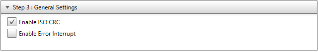

<a href="https://www.microchip.com" rel="nofollow"></a>

# INTRODUCTION

This example project showcases the setup and use of the new CAN FD module on the PIC18-Q84 family of devices, specifically the use of MPLAB Code Configurator (MCC) to set up Baud Rate, receive masks/filters, and to handle the receive/transmit FIFOs.  The code periodically transmits CAN frames on a 1 second interval, echoes incoming messages with a specific message ID, and sets LEDs based on data with a different specific message ID.  

## Related Documentation

A Technical Brief explaining the details of the new CAN FD module will be published soon.

## Software Used
- MPLAB® X IDE 5.40 or newer [(microchip.com/mplab/mplab-x-ide)](http://www.microchip.com/mplab/mplab-x-ide)
- MPLAB® XC8 2.20 or a newer compiler [(microchip.com/mplab/compilers)](http://www.microchip.com/mplab/compilers)
- MPLAB® Code Configurator (MCC) 3.95.0 or newer [(microchip.com/mplab/mplab-code-configurator)](https://www.microchip.com/mplab/mplab-code-configurator)
- MPLAB® Code Configurator (MCC) Device Libraries PIC10 / PIC12 / PIC16 / PIC18 MCUs 1.81.1 or newer [(microchip.com/mplab/mplab-code-configurator)](https://www.microchip.com/mplab/mplab-code-configurator)
- Microchip PIC18F-Q Series Device Support (1.6.129) or newer [(packs.download.microchip.com/)](https://packs.download.microchip.com/)

## Hardware Used
  - [PIC18F47Q84 Microcontroller](https://www.microchip.com/wwwproducts/en/PIC18F47Q84)
  - [Curiosity High Pin Count (HPC) Development Board](https://www.microchip.com/developmenttools/ProductDetails/PartNO/DM164136)
  - [ATA6563 Click Board](https://www.mikroe.com/ata6563-click)
  - [K2L Optolyzer® MOCCA FD](https://www.k2l.de/products/39/OptoLyzer%C2%AE%20MOCCA%20FD/)

## Setup

The Curiosity HPC Board is used in conjunction with the ATA6563 click board as the development platform.  In addition, two jumper wires are used, one connecting  as the PIC18F47Q84 CAN FD PPS selections do not match the options available for the click board connections on the Curiosity HPC Board.  In addition, some form of CAN FD capable CAN bus analyzer is needed to view the outgoing CAN frames and send incoming CAN frames to the device (the K2L MOCCA FD was used for internal testing of this setup).

#### Hardware Setup Images:


The project software was developed in MPLAB X with the help of the MPLAB Code Configurator (MCC) plug-in tool.  The MCC tool provides a user-friendly interface that generates software based on the user’s parameters. MCC allows developers who may not be familiar with a new peripheral a way to quickly set up and test a peripheral without having to dive deep into the device datasheet. For this project, the MCC tool was used to generate code for both the CAN FD baud rate, masks, filters, and Transmit/Receive FIFO handling, as well as the Timer0 module for timing the CAN FD transmissions.  The CAN FD Receive interrupt initial setup was also performed using MCC, with the behavior of the interrupt routines being configured in code.  

### System Configuration:
The system is set up to use HFINTOSC at 32MHz.  This is purely for demonstration purposes as the Curiosity HPC board does not have an external oscillator at the proper frequency.  For actual CAN FD applications it is highly recommended to use either an external clock module at 40Mhz (EXTOSC mode with EC above 8Mhz), an external crystal at 10MHz or 20Mhz (EXTOSC with HS above 8Mhz) or an external crystal at 10Mhz with the 4x PLL enabled (EXTOSC 4X PLL with HS above 8MHz).  The MCC setup makes these changes quick and easy, and will alter both the TMR0 and CAN FD baud rate setup to match any changes to the source clock.  

#### MCC System Module Editor Window and Code:


### TMR0 Configuration:
The TMR0 module was configured such that it would interrupt at a 1Hz, so that the periodic CAN FD messages would be sent once per second.  

#### MCC TMR0 Editor Window and Code:


```c
void TMR0_Initialize(void)
{
    // Set TMR0 to the options selected in the User Interface

    // T0CS FOSC/4; T0CKPS 1:32768; T0ASYNC not_synchronised; 
    T0CON1 = 0x5F;

    // TMR0H 121; 
    TMR0H = 0x79;

    // TMR0L 0; 
    TMR0L = 0x00;

    // Clear Interrupt flag before enabling the interrupt
    PIR3bits.TMR0IF = 0;

    // Enabling TMR0 interrupt.
    PIE3bits.TMR0IE = 1;

    // Set Default Interrupt Handler
    TMR0_SetInterruptHandler(TMR0_DefaultInterruptHandler);

    // T0OUTPS 1:2; T0EN enabled; T016BIT 8-bit; 
    T0CON0 = 0x81;
}
```

### PORT and PPS Configuration:
PORTA[4-7] are configured initially as output low, as those pins are connected to the LEDs for output of incoming CAN FD data.  PORTD6 is configured as CANTX and PORTD7 is configured as CANRX.

#### MCC PORT Editor Window and Code:


```c
void PIN_MANAGER_Initialize(void)
{
    /**
    LATx registers
    */
    LATE = 0x00;
    LATD = 0x00;
    LATA = 0x00;
    LATB = 0x00;
    LATC = 0x00;

    /**
    TRISx registers
    */
    TRISE = 0x07;
    TRISA = 0x0F;
    TRISB = 0xFF;
    TRISC = 0xFF;
    TRISD = 0xBF;

    /**
    ANSELx registers
    */
    ANSELD = 0x3F;
    ANSELC = 0xFF;
    ANSELB = 0xBF;
    ANSELE = 0x07;
    ANSELA = 0xFF;

    /**
    WPUx registers
    */
    WPUD = 0x00;
    WPUE = 0x00;
    WPUB = 0x00;
    WPUA = 0x00;
    WPUC = 0x00;

    /**
    ODx registers
    */
    ODCONE = 0x00;
    ODCONA = 0x00;
    ODCONB = 0x00;
    ODCONC = 0x00;
    ODCOND = 0x00;

    /**
    SLRCONx registers
    */
    SLRCONA = 0xFF;
    SLRCONB = 0xFF;
    SLRCONC = 0xFF;
    SLRCOND = 0xFF;
    SLRCONE = 0x07;

    /**
    INLVLx registers
    */
    INLVLA = 0xFF;
    INLVLB = 0xFF;
    INLVLC = 0xFF;
    INLVLD = 0xFF;
    INLVLE = 0x0F;
    
    CANRXPPS = 0x1F;   //RD7->CAN1:CANRX;    
    RD6PPS = 0x46;   //RD6->CAN1:CANTX;    
}
```

### CAN FD Configuration:
The CAN FD easy setup has 5 sections.  The first is clock setup.  For this setup, the system clock is used, so system clock is selected.  This will automatically populate the clock frequency (FCAN) window.  


The second step is Bit Rate Settings.  This configures the nominal and data bit rate (if applicable) based on FCAN.  For this example, a 500 Kbps nominal rate and 2Mbps data rate are selected, the nominal bit rate having 64 TQs per bit, the data bit rate having 16 TQs per bit, and the sample point being 75% for both bit rates.


```c
static void CAN1_BitRateConfiguration(void)
{
    // SJW 11; 
    C1NBTCFGL = 0x0B;
    
    // TSEG2 11; 
    C1NBTCFGH = 0x0B;
    
    // TSEG1 50; 
    C1NBTCFGU = 0x32;
    
    // BRP 0; 
    C1NBTCFGT = 0x00;
    
    // SJW 2; 
    C1DBTCFGL = 0x02;
    
    // TSEG2 2; 
    C1DBTCFGH = 0x02;
    
    // TSEG1 11; 
    C1DBTCFGU = 0x0B;
    
    // BRP 0; 
    C1DBTCFGT = 0x00;
    
    // TDCO 12; 
    C1TDCH = 0x0C;
    
    // TDCMOD Auto; 
    C1TDCU = 0x02;
}
```
The third step is general settings.  This only has two options: Enable ISO CRC and Enable Error Interrupt.  The ISO CRC is a standard for CAN FD and is in enabled for this example, but some older CAN FD devices/buses may use the non-ISO CRC.  The Error Interrupt is for potential issues on messages/buses, and is not used in this demonstration.  


The fourth step is the FIFO settings.  Here is where the transmit and receive FIFOs are set up.  It allows for setting up depth, payload size, and TX/RX selection for each FIFO, while showing how much of the FIFO space is being consumed by the currently selected FIFOs.  In addition, this allows for selecting specific interrupt triggers for each FIFO which will generate the function prototypes/pointers for these interrupts in the code.  In this example, the TXQ is used as the transmit FIFO, with FIFO1 and FIFO2 being set as receive.  All three are set to a depth of 6 and a payload of 32 bytes, with both receive FIFOs set to interrupt on not-empty.  


```c
static void CAN1_RX_FIFO_Configuration(void)
{
    // TXEN disabled; RTREN disabled; RXTSEN disabled; TXATIE disabled; RXOVIE disabled; TFERFFIE disabled; TFHRFHIE disabled; TFNRFNIE enabled; 
    C1FIFOCON1L = 0x01;
    
    // FRESET enabled; TXREQ disabled; UINC disabled; 
    C1FIFOCON1H = 0x04;
    
    // TXAT Unlimited number of retransmission attempts; TXPRI 1; 
    C1FIFOCON1U = 0x60;
    
    // PLSIZE 32; FSIZE 6; 
    C1FIFOCON1T = 0xA5;
    
    // TXEN disabled; RTREN disabled; RXTSEN disabled; TXATIE disabled; RXOVIE disabled; TFERFFIE disabled; TFHRFHIE disabled; TFNRFNIE enabled; 
    C1FIFOCON2L = 0x01;
    
    // FRESET enabled; TXREQ disabled; UINC disabled; 
    C1FIFOCON2H = 0x04;
    
    // TXAT Unlimited number of retransmission attempts; TXPRI 1; 
    C1FIFOCON2U = 0x60;
    
    // PLSIZE 32; FSIZE 6; 
    C1FIFOCON2T = 0xA5;
    
    CAN1_SetFIFO1NotEmptyHandler(DefaultFIFO1NotEmptyHandler);
    CAN1_SetFIFO2NotEmptyHandler(DefaultFIFO2NotEmptyHandler);
    
    C1INTUbits.RXIE = 1;
    
    PIR4bits.CANRXIF = 0;
    PIE4bits.CANRXIE = 1;
}
```

```c
static void CAN1_TX_FIFO_Configuration(void)
{
    // TXATIE disabled; TXQEIE disabled; TXQNIE disabled; 
    C1TXQCONL = 0x00;
    
    // FRESET enabled; UINC disabled; 
    C1TXQCONH = 0x04;
    
    // TXAT 3; TXPRI 1; 
    C1TXQCONU = 0x60;
    
    // PLSIZE 32; FSIZE 6; 
    C1TXQCONT = 0xA5;
    
}
```
The final step is the Filter Object Settings.  This allows for setup of masks and filters, which determine which message IDs are accepted.  Each filter object can be associated with a specific receive FIFO and any number of message IDs can be entered, which will automatically set up the masks/filters to accept those IDs.  


```c
static void CAN1_RX_FIFO_FilterMaskConfiguration(void)
{
    // FLTEN0 enabled; F0BP FIFO 1; 
    C1FLTOBJ0L = 0x11;
    C1FLTOBJ0H = 0x01;
    C1FLTOBJ0U = 0x00;
    C1FLTOBJ0T = 0x00;
    C1MASK0L = 0xFF;
    C1MASK0H = 0x07;
    C1MASK0U = 0x00;
    C1MASK0T = 0x40;
    C1FLTCON0L = 0x81; 
    
    // FLTEN1 enabled; F1BP FIFO 2; 
    C1FLTOBJ1L = 0x85;
    C1FLTOBJ1H = 0xAD;
    C1FLTOBJ1U = 0x03;
    C1FLTOBJ1T = 0x00;
    C1MASK1L = 0xFF;
    C1MASK1H = 0x2F;
    C1MASK1U = 0x80;
    C1MASK1T = 0x53;
    C1FLTCON0H = 0x82; 
    
}
```
In addition to the generated code, the two receive interrupts and the TMR0 interrupt were written using the generated CAN FD APIs.  

```c
static void DefaultFIFO1NotEmptyHandler(void)
{
    CAN_MSG_OBJ EchoMessage;  //create a message object for holding the data
    while(1)
    {
        if(CAN1_ReceivedMessageCountGet() > 0) //check for received message
        {
            if(true == CAN1_Receive(&EchoMessage)) //receive the message
            {
                break;
            }
        }
    }
    EchoMessage.msgId=0x222; //Change the ID to 0x222 then echo the message back out
if(CAN_TX_FIFO_AVAILABLE == (CAN1_TransmitFIFOStatusGet(TXQ) & CAN_TX_FIFO_AVAILABLE))
    {
        CAN1_Transmit(TXQ, &EchoMessage); //Send the message
    }
}
```
```c
void TMR0_DefaultInterruptHandler(void){
    CAN_MSG_OBJ Transmission;  //create the CAN message object
    uint8_t Transmit_Data[8]={0x00,0x11,0x22,0x33,0x44,0x55,0x66,0x77}; // data bytes
    Transmission.field.brs=CAN_BRS_MODE; //Transmit the data bytes at data bit rate
    Transmission.field.dlc=DLC_8; //8 data bytes
    Transmission.field.formatType=CAN_FD_FORMAT; //CAN FD frames 
    Transmission.field.frameType=CAN_FRAME_DATA; //Data frame
    Transmission.field.idType=CAN_FRAME_STD; //Standard ID
    Transmission.msgId=0x100; //ID of 0x100
    Transmission.data=Transmit_Data; //transmit the data from the data bytes
    if(CAN_TX_FIFO_AVAILABLE == (CAN1_TransmitFIFOStatusGet(TXQ) & CAN_TX_FIFO_AVAILABLE))//ensure that the TXQ has space for a message
                {
                    CAN1_Transmit(TXQ, &Transmission); //transmit frame
                }
    
}
```
```c
static void DefaultFIFO2NotEmptyHandler(void)
{
    CAN_MSG_OBJ InternalMessage; //create a message object for holding data
    uint8_t DataIndex=0;  //placeholder variable for calculations
    while(1)
    {
        if(CAN1_ReceivedMessageCountGet() > 0) //check for received message
        {
            if(true == CAN1_Receive(&InternalMessage)) //receive the message
            {
                break;
            }
        }
    }
    DataIndex=InternalMessage.data[0]/32; //calculate which data byte to use
    LATA=InternalMessage.data[DataIndex]; //output the data byte to the LEDs
}
```
## Operation

On Power up, the code will periodically transmit messages with an ID of 0x100 and 8 bytes of data every 1 second.


Sending a message with an ID of 0x111 will cause the device to respond with an echo frame with an ID of 0x222 and identical data frames


Sending a message with an ID of 0x585 will cause the device to divide the value of the first data byte by 32, then use that result to determine which of the data bytes to display.  It will then display the 4 least significant bits of that data byte on the LEDs on the Curiosity Board


## Summary

This Demo gives basic examples of using MCC to perform CAN FD bit rate setup, message transmission, and message reception with both filtering and interrupt-driven responses.
